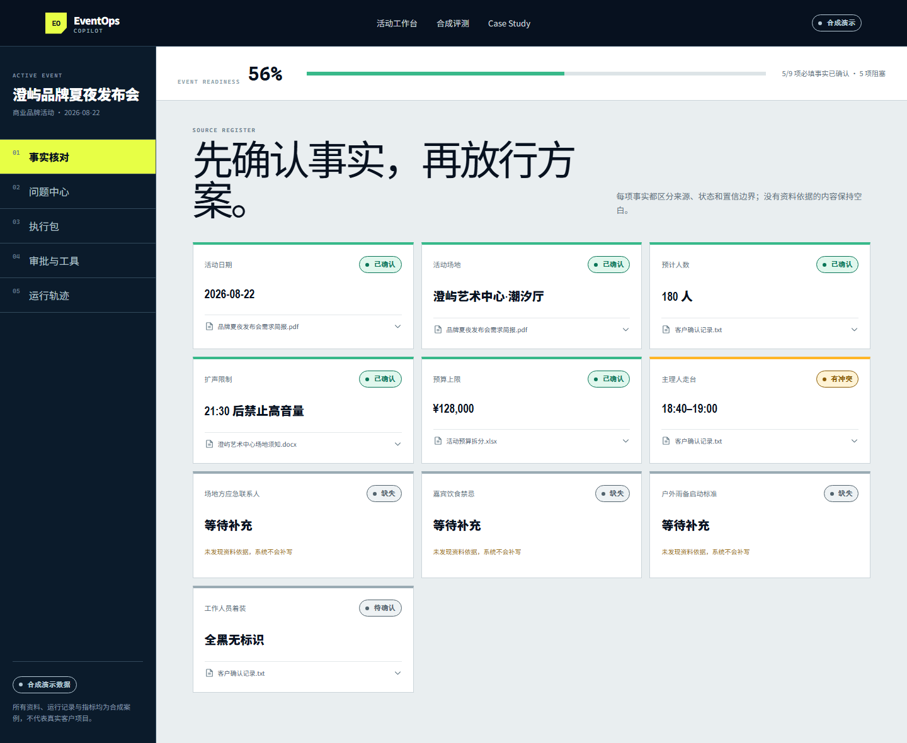

# EventOps Copilot

> 从分散活动资料中核对事实、发现冲突，并生成可审批的执行包。

[本地 Demo](#本地运行) · [产品 Case Study](docs/CASE_STUDY.md) · [PRD](docs/PRD.md) · [技术架构](docs/ARCHITECTURE.md)



## 30 秒了解

普通 AI 活动 Demo 往往从聊天框开始生成方案。EventOps Copilot 先建立有原文出处的事实登记册，让缺项保持缺失、冲突阻塞审批，再生成时间轴、岗位分工、物料和风险预案。外部写操作必须经人工确认。

## 可体验场景

- 展开事实来源，回到文件位置与原文片段。
- 查看故意预置的场控时间冲突和三个缺失字段。
- 比较资料事实、人工确认与行业模板建议。
- 尝试审批，观察阻塞门槛。
- 查看合成运行轨迹和合成评测分母。

## 真实性边界

| 状态 | 内容 |
|---|---|
| 已实现 | 交互工作台、事实引用、冲突/缺项、执行包、审批、运行轨迹、合成评测 |
| 模拟执行 | 文档解析结果、模型生成记录、日历调用、Token 与成本 |
| 待配置 | 真实模型 API、日历 OAuth |
| 待真实验证 | 真实资料解析、从业者修改率、任务完成率和效率影响 |

无法获得真实从业者测试和真实业务数据，因此仓库不展示虚构用户、反馈或效率提升。

## 架构取舍

- 使用受控单工作流，不使用多 Agent：更容易审计、评测和控制成本。
- 规则代码负责时间冲突与审批门槛；模型不承担确定性计算。
- RAG 用于检索资料并提供引用；生产建议 PostgreSQL + pgvector。
- 公开 Demo 使用版本化合成 fixture，保证无密钥可复现。

## 本地运行

需要 Node.js 20+。

```bash
pnpm install
pnpm dev
```

访问 `http://localhost:3000`。

## 验证

```bash
pnpm test:run
pnpm lint
pnpm build
pnpm test:e2e
```

## 项目结构

```text
src/app/          页面与路由
src/components/   产品组件
src/domain/       纯函数业务规则与评测
src/data/         版本化合成案例
docs/             PRD、架构、Case Study、简历描述
e2e/              浏览器关键路径
```

## 路线图

1. 用获得授权的脱敏真实活动资料建立评测基线。
2. 接入真实 PDF/DOCX/XLSX 解析和混合检索。
3. 完成 Google/Outlook Calendar OAuth 与幂等写入。
4. 在真实数据支持后再判断是否需要多 Agent。

## License

[MIT](LICENSE)
